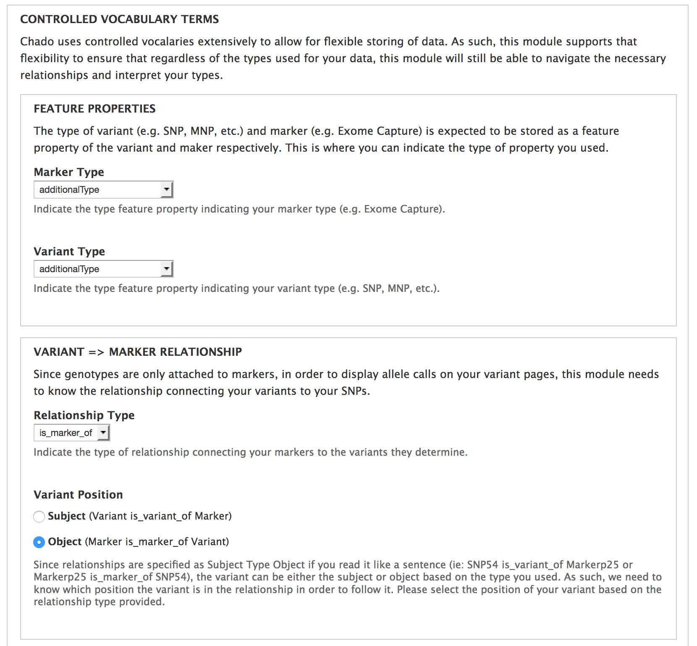
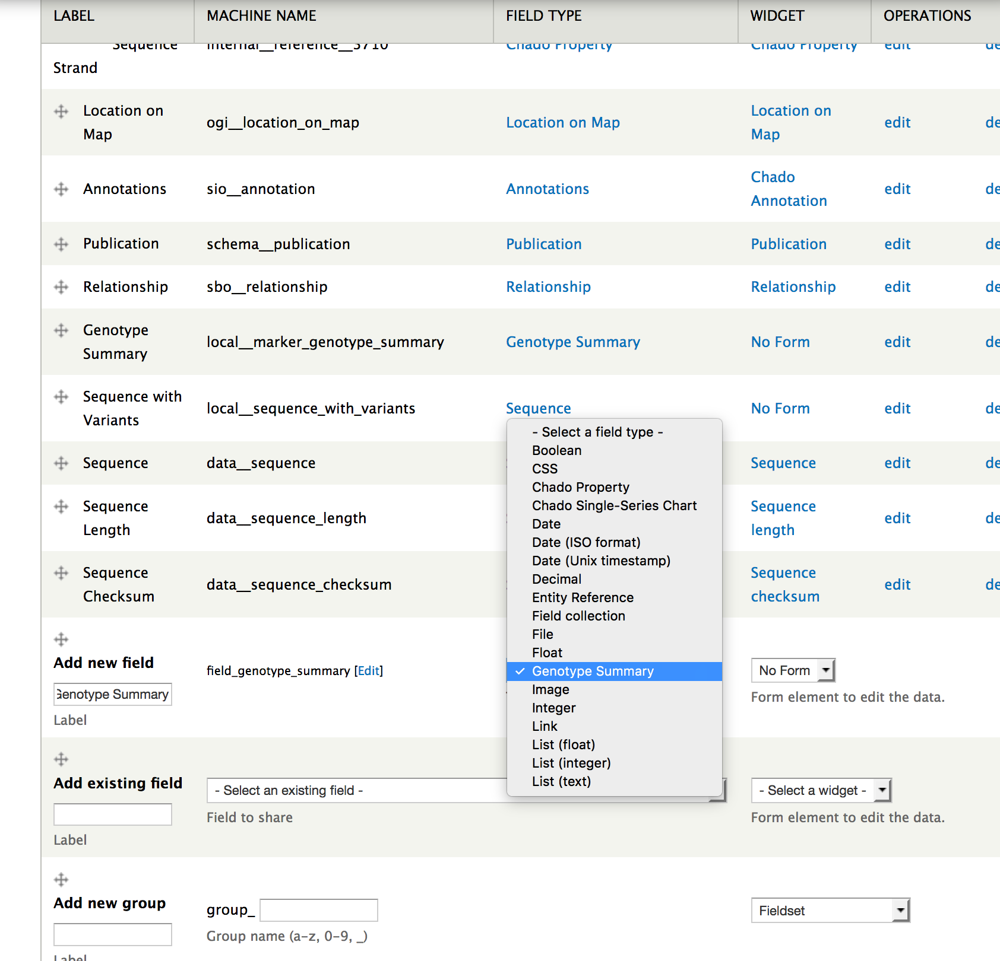
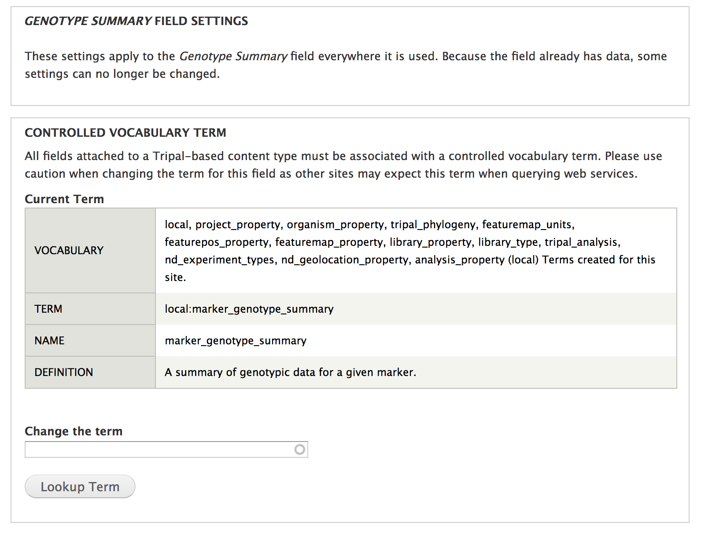
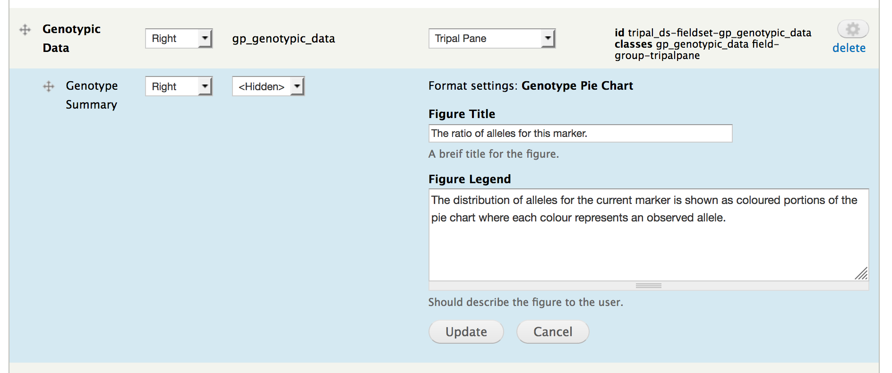
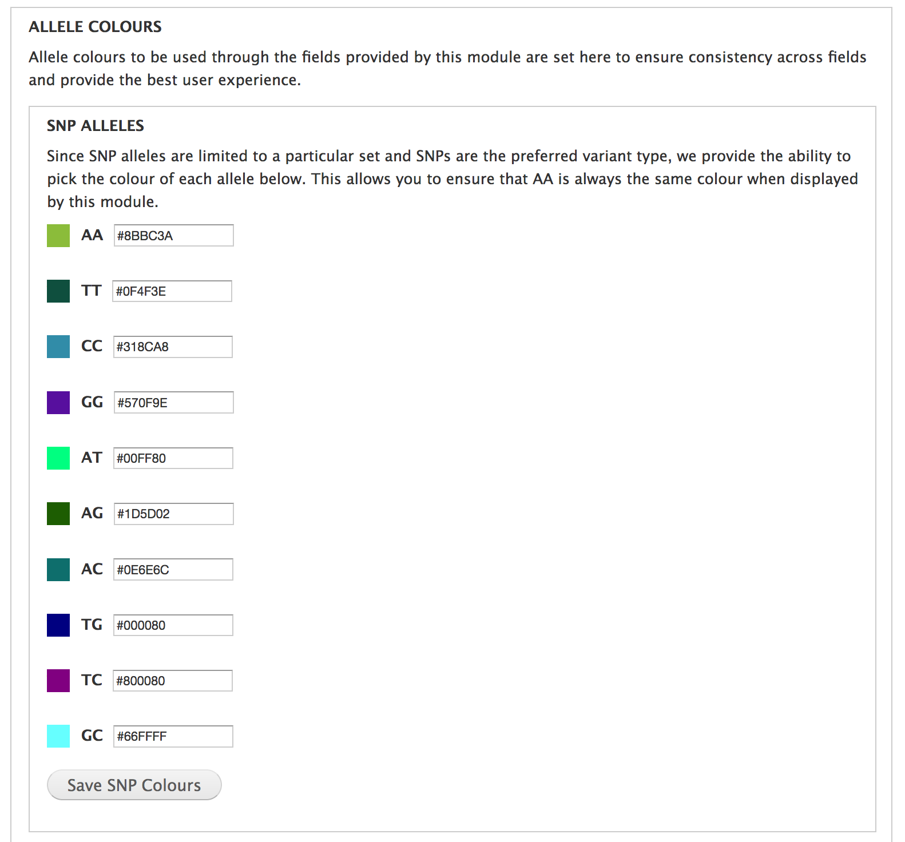
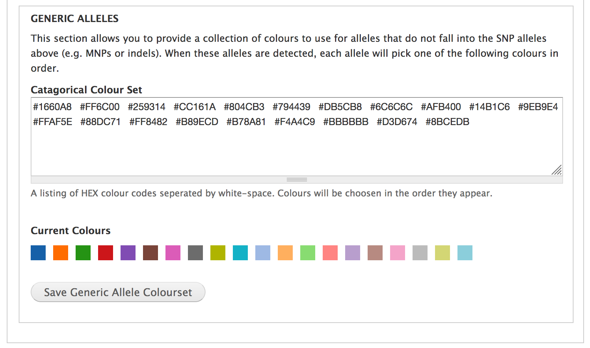

Configuration
=============

Set Controlled Vocabulary Terms
--------------------------------

1. Navigate to Administration » Tripal » Extensions » Natural Diversity Genotypes » Settings
2. Under "Controlled Vocabulary Terms" you will see a number of drop-downs. Simply set these to the terms you use in your chado database. This allows ND Genotypes to better support the flexibility of Chado and allows you to use the terms most fitting for your data.

3. Click "Save Terms" once you've set them all appropriately.

Add Genotype Summaries to Variant/Marker Pages
----------------------------------------------

1. Navigate to Administration » Structure » Tripal Content Types » [Variant/Marker] » Manage Fields
2. Scroll down to "Add a new field", enter a label and select "Genotype Summary" from the first drop-down.

3. Choose a term for the field or create a local one

4. Navigate to "Manage Display" for the same content type and ensure the field you just created is placed where you would like it to be.

.. warning::

  Ensure that the field is not in the "Disabled" section under "Manage Display"; otherwise, it will not appear on the page.

5. You can also configure the figure legend. On the "Manage Display" page, click the gear icon at the far right of the Genotype Summary field.

.. warning::

  Make sure to click "Update" in the blue settings pane; as well as, "Save" at the bottom of the page.

Set Preferred Allele Colours (Optional)
----------------------------------------

You can also change the colours used for the genotype matrix and summary charts:

1. Navigate to Administration » Tripal » Extensions » Natural Diversity Genotypes » Settings
2. Under "Allele Colours" enter the HEX code for the colours you would like to use. Once you save the colours, you will see your choice demonstrated in front of the allele.

3. You can also indicate a collection of colours you would like to be used for alleles that don't fall into the typical SNP categories such as MNPs.

