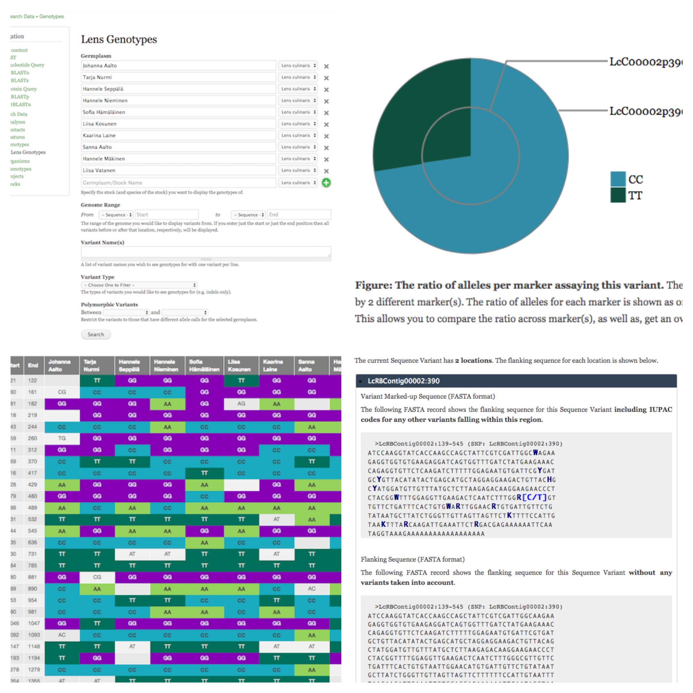

Features
========

- Extensive configuration allowing for flexiblity in ontology terms used, as well as, colours and wording used in visualizations.
- Multiple Tripal 3 Fields which provide flexible, configurable summaries of genotypic data.
    - Marker/Variant Genotype Summary: a pie chart showing the ratio of alleles recorded per marker.
    - Marker/Variant Flanking Sequence: a FASTA record showing flanking sequence with all known variants indicated via IUPAC codes (useful in marker design).
    - Marker List: provides links to the markers assaying a given variant.
    - Genotype Matrix Quick Link: provides a quick link to a pre-filtered genotype matrix. How it is filtered is dependent on the page it is on:
        - On Marker/Variant pages: restricted to specific variant
        - On Germplasm pages: germplasm is pre-selected
        - On Project pages: project is pre-selected if genus is a property of the project.
- Genotype Matrix search allowing users to extract genotypes for a user-defined set of germplasm. Includes filtering by marker/variant type, variant location, and pairwise polymorphism. Filtering by quality is coming soon.
- Integration of all fields with Tripal 3 web services allowing you to share your genotypic data with other groups.

.. note::

  If ND Genotypes fields are not automatically attached to the genetic marker and sequence variant content types, go to the "Manage Fields" page for each and click "Find new fields". Also, go to the "Manage Display" page and ensure they are not hidden.

.. toctree::
   :maxdepth: 2
   :caption: Further Detail:

   features/genotype_matrix
   features/feature_genotype_summaries
   features/sequence_with_variants_field
   features/genotype_matrix_link

The following screenshots are meant to visually summarize the features. For more detail, please click on one of the features above.

