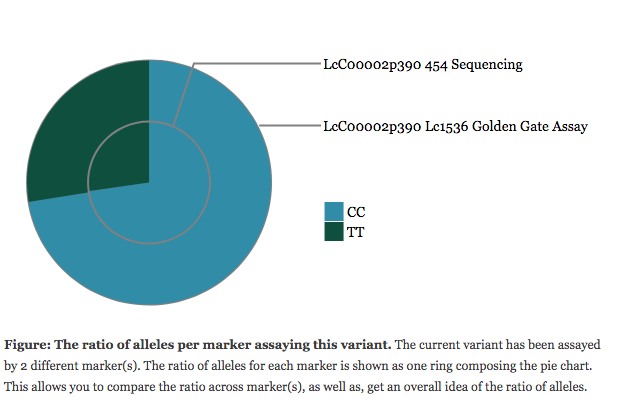
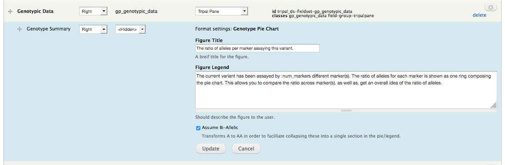

Marker/Variant Genotype Summary Fields
======================================

This field adds a summary pie chart figure to marker or variant pages. It shows the ratio of alleles saved for the given marker/variant and can be used to give the researcher an idea of what alleles to expect when using the marker, as well as, how rare a given result might be.

Both the title and description of the figure legend can be configured by going to Administration » Structure » Tripal Content Types » [Variant/Marker] » Manage Display and clicking on the gear beside the genotype summary field.

.. warning::

  Make sure to click "Update" in the blue settings pane; as well as, "Save" at the bottom of the page.