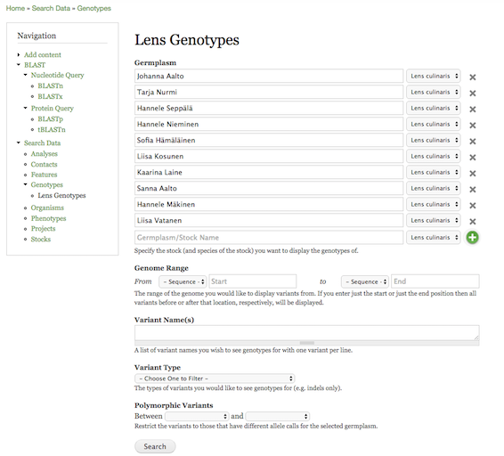
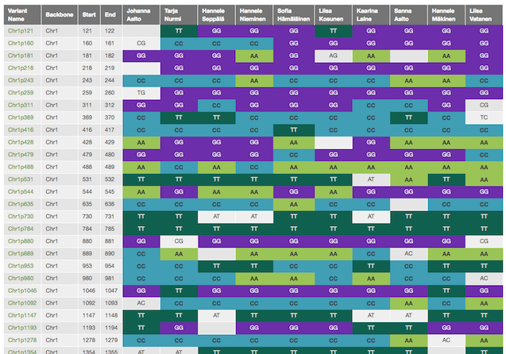

Genotype Matrix
===============

This module provides genotype search functionality that allows users to select which germplasm and variants they are interested in and be shown a colour-coded variant by germplasm table which can be further filtered by marker/variant type and to only show polymorphic variants (pairwise comparison choosen by the user). After filtering to their desired dataset, the user can download the table as a tab-delimited file.

As you can see in the following screenshot, the user can enter any number of germplasm depending upon their needs. Additionally, the filter criteria is well-defined including helpful descriptions under each one.

This is the matrix resulting from the above filter criteria. As you can see, each column represents one of the chosen germplasm and each row represents a specific variant.

