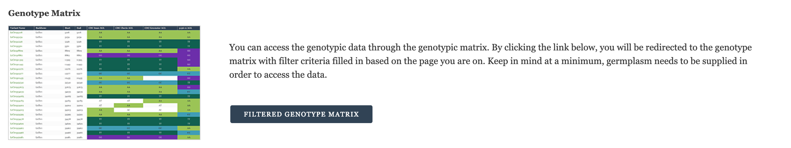

Genotype Matrix Quick Link
============================

This field provides a quick link to the genotype matrix from project, germplasm, marker and variant pages. It pre-filters the genotype matrix to data relating to the page it's on. For example, on a germplasm page (any content type storing data in the Chado stock table) the user will be taken to a genotype matrix of the correct genus already displaying genotypes for the germplasm they were looking at.

The link is consistent across content types and does not need to be configured. It automatically detects the type of content it is on and adds information to link to pre-filter the genotype matrix accordingly.

Project Pages
----------------

Project pages are any Tripal Content which stores it's base data in the Chado project table including "Study", "Genome Project" and "Project" default Tripal Content Types. The genus is determined based on a Chado property with cvterm TAXRANK:genus and the genotype matrix link with simply not appear on content without this property. The unique project identifier is used to pre-filter the genotype matrix to data from the project the researcher was viewing. Once clicking through to the genotype matrix, the researcher still needs to select which germplasm they want to see the data for.

Variant Pages
---------------

Variant pages are any Tripal Content which stores it's base data in the Chado Feature table and are of type SO:sequence_variant including the default Tripal Content Type "Sequence Variant". The genus is determined based on the associated organism and the variant name is used to pre-filter the genotype matrix to data specific to the variant being viewed by the researcher. Once clicking through to the genotype matrix, the researcher still needs to select which germplasm they want to see the data for.

Genetic Marker Pages
----------------------

Genetic Marker pages are any Tripal Content which stores it's base data in the Chado Feature table and are of type SO:genetic_marker including the default Tripal Content Type "Genetic Marker". The genus is determined based on the associated organism. The Genotype Matrix will be pre-filtered to any sequence variants related to the current genetic marker. Once clicking through to the genotype matrix, the researcher still needs to select which germplasm they want to see the data for.

Germplasm Pages
-----------------

Germplasm pages are any Tripal Content which stores it base data in the Chado stock table including "Germplasm Accession" and "Cultivar (germplasm Variety)" and "Generated Germplasm (breeding Cross)" default Tripal Content Types. The genus is determined based on the associated organism and the unique germplasm identifier is used to ensure the pre-filtered matrix is showing the correct germplasm to the user. This provides a great way for researchers to access the genotypic data quickly and intuitively from the germplasm page.
