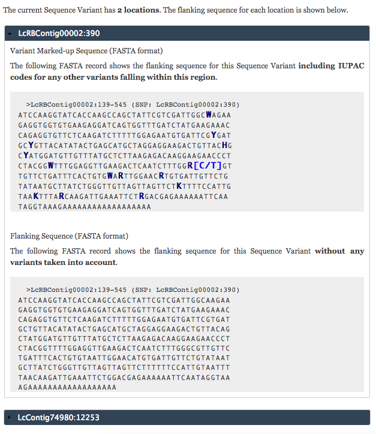
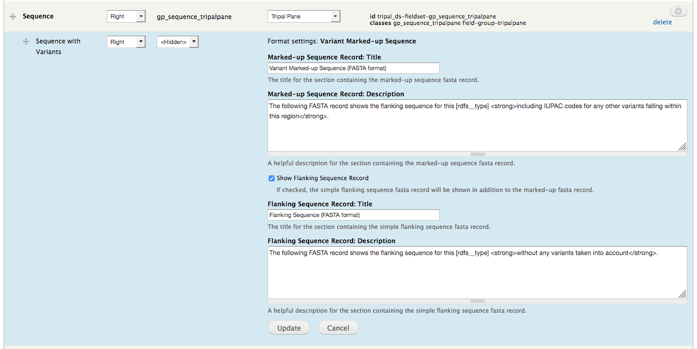

Marker/Variant Flanking Sequence Field
======================================

This field adds a FASTA record showing the flanking sequence for the current marker variant. It also highlights the variants in the flanking region with their IUPAC codes. This field seamlessly handles variants with multiple locations by showing each one with the first one by rank expanded.

Both the title and description of the figure legend can be configured by going to Administration » Structure » Tripal Content Types » [Variant/Marker] » Manage Display and clicking on the gear beside the genotype summary field.

.. warning::

  Make sure to click "Update" in the blue settings pane; as well as, "Save" at the bottom of the page.
